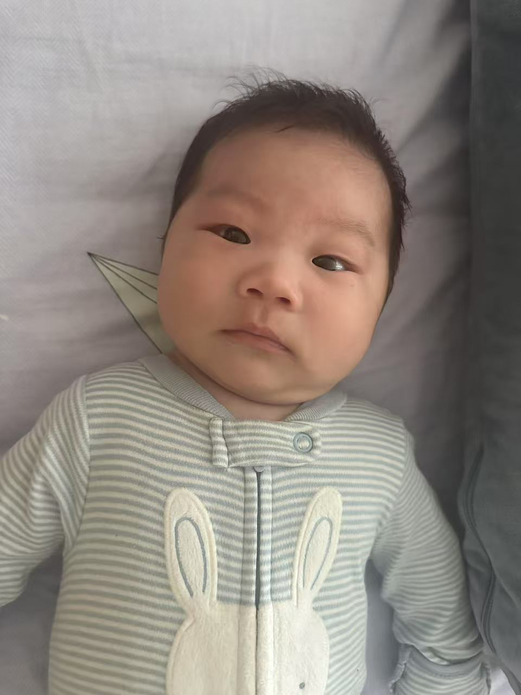
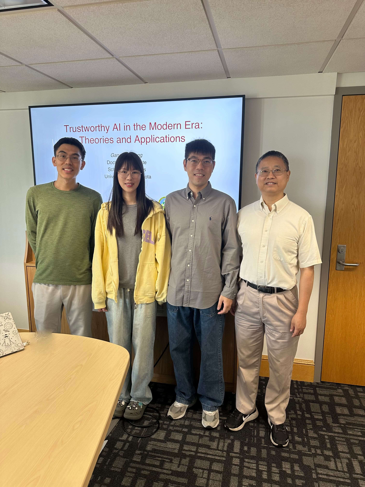
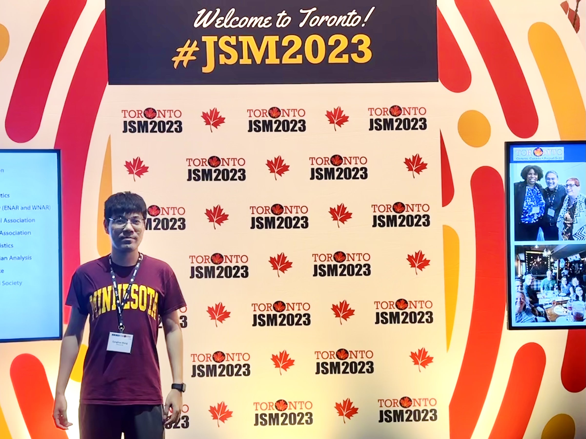
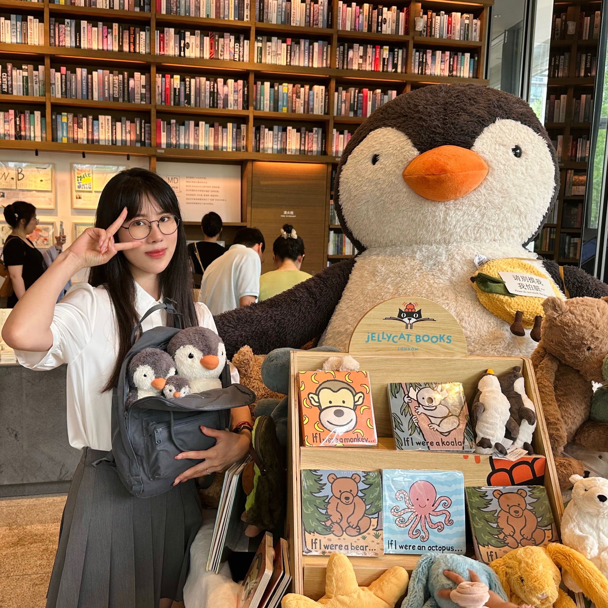
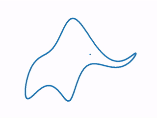

[comment]: <> FF0234(red) FF7902(orange) 1F70CB(blue)

This is a personal website of Ganghua Wang, created using [Jekyll](https://jekyllrb.com/).

## Gallery

### *2025*{: .h1s}

<figure>

<figcaption style="text-align: left;"> Hello World, Luca! Welcomed our first kid. </figcaption> 
</figure>

### *2024*{: .h1s}

<figure>

<figcaption style="text-align: left;"> After my defense. From left to right are Prof. <a href="https://jding.org/">Jie Ding</a>, Yingyu Shen, Ganghua Wang, and Prof. <a href="https://cla.umn.edu/about/directory/profile/yangx374">Yuhong Yang</a>. </figcaption> 
</figure>

### *2023*{: .h1s}

<figure>

<figcaption style="text-align: left;"> Me attending JSM 2023, Toronto, Canada. </figcaption> 
</figure>

<figure>

<figcaption style="text-align: left;" width="500px"> Yingyu Shen (Left 1); big, medium, and small good sons (in the backpack); really big peanut penguin (Right 1). It is my fortune to have you as my wife and have those three adorable "kids".  </figcaption> 
</figure>

### *2021*{: .h1s}

[comment]: <> {:  width="500px" style='float:left; margin-right: 5%'} 

<figure>

<figcaption style="text-align: left;"> Lake Superior. From left to right are Xinran Wang, Prof. <a href="https://jding.org/">Jie Ding</a>, Prof. <a href="https://cla.umn.edu/about/directory/profile/yangx374">Yuhong Yang</a> and Ganghua Wang. </figcaption> 
</figure>

### *2020*{: .h1s}

{:  width="300px" style='float:left; margin-right: 5%'} 

<blockquote style='float:right'>

With four parameters I can fit an elephant, and with five I can make him wiggle his trunk. 
 <cite style='float:right'>-- John von Neumann</cite>
</blockquote>

[$\leftarrow$ How to fit an elephant like this?]()

### *2019*{: .h1s}

<figure>

<figcaption style="text-align: left;"> A comic from <a href="http://phdcomics.com/comics/archive.php?comicid=124"> PhD comics</a>. </figcaption> 
</figure>

  <figure style="float:right;width:250px;margin-right: 10em;">
  	
  	<figcaption style="text-align: right;">A picture of Ford Hall. </figcaption>
  </figure>

  <figure style="float:left;width:250px;">
  	
  	<figcaption style="text-align: left;">Thanks letter I received as TA. </figcaption>
  </figure>

### *2018*{: .h1s}

A toy example of style transfer: [Fast Patch-based Style Transfer of Arbitrary Style](https://arxiv.org/pdf/1612.04337.pdf?fbclid=IwAR2xiW2dBBmnARfERb4wcC2wmLIUC9puHrdgLVCKDj5wZO3dqTCnYTfKl6w).

<figure  >

<figcaption style="text-align: left;">Style picture. </figcaption></figure>

<figure >

<figcaption style="text-align: left">Original photo of Boya Tower,   Peking University. </figcaption></figure>

<figure >

<figcaption style="text-align: left;" >Final output. </figcaption></figure>

For the sake of completeness, I attach a pic of Weiming Lake below as well.
<figure  >

<figcaption style="text-align: left;">Weiming Lake, Peking University. </figcaption></figure>

### *2017*{: .h1s}

{:  width="300px" style="float: left; margin-right:5%"} 

<blockquote style='float:right'>

A drunk man will find his way home, but a drunk bird may get lost forever. 
 <cite style='float:right'>-- Shizuo Kakutani</cite>
</blockquote>

The first time I heard this story is from my instructor of *Applied Stochastic Processes*, [Prof. Dayue Chen](http://www.math.pku.edu.cn/teachers/dayue/indexE.htm).

Another example I learned in this course is that "Life is a martingale." Though he meant that life is ergodic and don't feel upset when you meet troubles, I hope that life can be a sub-martingale.

[\\]: <> 
<blockquote > Life is a martingale.</blockquote>

