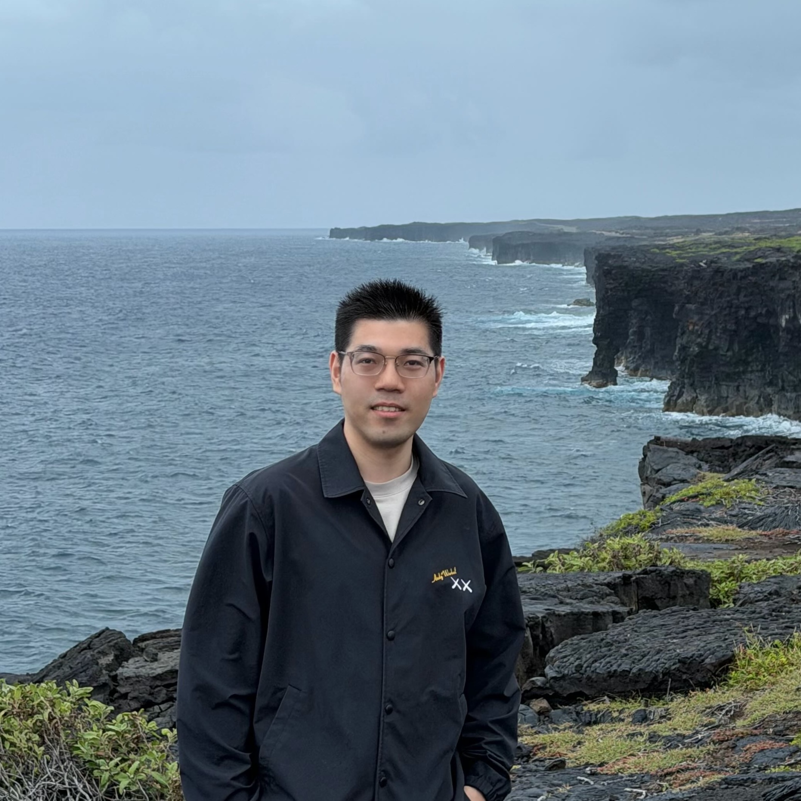

---
# Feel free to add content and custom Front Matter to this file.
# To modify the layout, see https://jekyllrb.com/docs/themes/#overriding-theme-defaults

layout: home
permalink: /
---

 

	
  
	
     
    
  
    <big><i><b>Ganghua Wang</b></i></big>  
    <i>Faraco Postdoctoral Fellow</i>  
    <a href="https://datascience.uchicago.edu/" target="_blank"><i>Data Science Institute</i></a>  
     <i>University of Chicago</i>     
5460 S University Avenue, Room 202 
    Chicago IL, 60615 
    

  
	
  
	
    

      Hi, I am Ganghua Wang, a Faraco Postdoctoral Fellow at the Data Science Institute, University of Chicago, fortunately mentored by Prof. Haifeng Xu and Prof. Bo Li. I received my Ph.D. in Statistics from University of Minnesota in 2024, where I was fortunate to be advised by Prof. Jie Ding and Prof. Yuhong Yang. My current research focuses on trustworthy AI, exploring both its theoretical foundations and the development of practical algorithms. Feel free to visit my website to learn more about my research. 
 
      

      I will join the Department of Mathematics at the University of Arizona as a tenure-track Assistant Professor starting in August 2026. I am always looking for self-motivated graduate students to join my group. If you are interested in working with me, please feel free to contact me and include your CV. 
 

   
<strong>News</strong>

   
 Our paper “Model Privacy: A Unified Framework for Understanding Model Stealing Attacks and Defenses.” was accepted by the Journal of the Royal Statistical Society, Series B!

   
I am honored to be <a href="https://datascience.uchicago.edu/news/two-postdoctoral-scholars-awarded-fellowships/">selected as the DSI Faraco Postdoctoral Fellow</a> for the 2025–2026 academic year, and I am grateful for this recognition and support.

