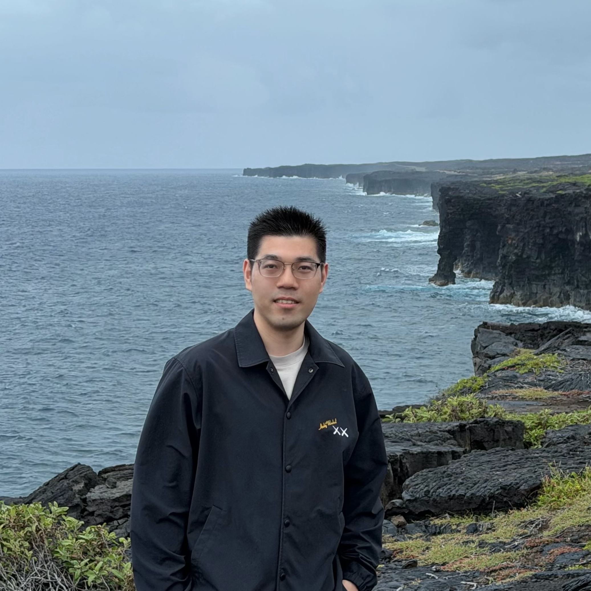

---
# Feel free to add content and custom Front Matter to this file.
# To modify the layout, see https://jekyllrb.com/docs/themes/#overriding-theme-defaults

layout: home
permalink: /
---

 

	
  
	
     
    
  
    <big><i><b>Ganghua Wang</b></i></big>  
    <i>Assistant Professor</i>  
    <a href="https://https://www.math.arizona.edu/" target="_blank"><i>Department of Mathematics</i></a>  
     <i>University of Arizona</i>     
Room S363, 1064 E Lowell St 
    Tucson, AZ 85719
    

  
	
  
	
    

        Hi, I am Ganghua Wang, a Tenure-Track Assistant Professor at the Department of Mathematics, University of Arizona. I am also a member of the <a href="https://stat.arizona.edu/">Statistics & Data Science GIDP</a>. Before that, I was Faraco Postdoctoral Fellow at DSI, UChicago, fortunately mentored by Prof. Haifeng Xu and Prof. Bo Li. I received my Ph.D. in Statistics from University of Minnesota in 2024, where I was fortunate to be advised by Prof. Jie Ding and Prof. Yuhong Yang. 
 

     
My current research focuses on trustworthy AI, exploring both its theoretical foundations and the development of practical algorithms. I am always looking for self-motivated graduate students to join my group. If you are interested in working with me, please feel free to contact me and include your CV. 
 

   
<strong>News</strong>

   
[2026/05] I am co-organizing a session at INFORMS 2026 with <a href="https://www.yaofan29597.com/" target="_blank"> Dr. Fan Yao</a> on LLMs and Social Media Analytics, look forward to meeting you at SF! 
 

   
[2026/05] I will be presenting at ICSA 2026 and JSM 2026 -- happy to connect and chat! 
 

   
[2026/04] Our paper “Probabilistic Bisection Algorithm Provably Achieves Exponential Convergence” was accepted by ICML 
 

   
[2026/02] Our paper “Model Privacy: A Unified Framework for Understanding Model Stealing Attacks and Defenses.” was accepted by the Journal of the Royal Statistical Society, Series B! <a href="https://doi.org/10.1093/jrsssb/qkag059" target="_blank">[Click here for paper.]</a> 
 

   
[2025/10] I am honored to be <a href="https://datascience.uchicago.edu/news/two-postdoctoral-scholars-awarded-fellowships/">selected as the DSI Faraco Postdoctoral Fellow</a> for the 2025–2026 academic year, and I am grateful for this recognition and support.

