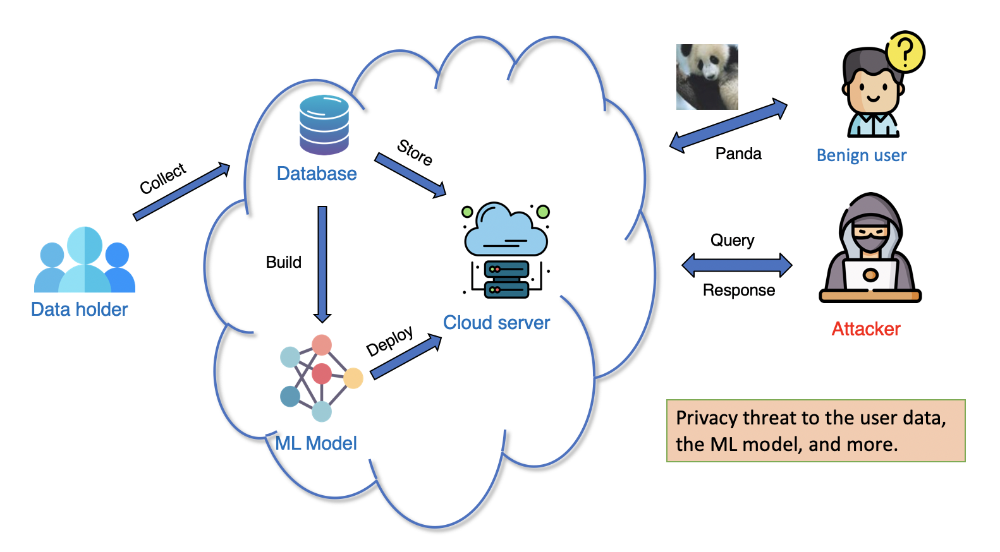

[comment]:<> {:style='color:#1F70CB'}
## **1. Privacy-preserving Machine Learning**{:style='color:#6f6fd9'}

{:  width="750px"}

Despite the tremendous success of modern machine learning methods, the concern of privacy and security has gained more and more attention. The privacy threat is inconspicuous but widely
exists in our daily lives. We risk privacy leakage for every step in the data processing life cycle, such as collection, storage, release, and analysis. Our goal is to develop privacy-preserving methods with built-in privacy guarantees.

[1] **Ganghua Wang** and  Jie Ding†. “Subset Privacy: Draw from an Obfuscated Urn”. In:arXiv preprint(2021).

[2] **Ganghua Wang**,  Jie Ding,  and Yuhong Yang†.  “Regression  with  Set-Valued  Categorical Predictors”. In:Statistica Sinica, to appear(2021)

[comment]:<> <embed src="{{site.baseurl}}/assets/resource/privacy.pdf" width="500" height="375" type="application/pdf">
 
## **2. Deep learning theory**{:style='color:#6f6fd9'}

<figure  >

<figcaption style="text-align: left;">Illustration of knowledge distribution. Picture credit to [Gao et al. 2021]. </figcaption></figure>

We are also interested in understanding the suceess of deep neural networks, such as the role of sparsity. 

[1] Gen Li, **Ganghua Wang**, Yuantao Gu, and Jie Ding†. “Provable Identifiability of ReLU Neural Networks via LASSO Regularization”. In:arXiv preprint(2021)