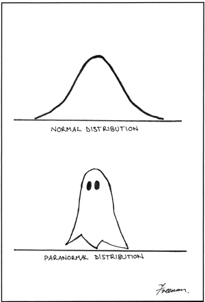

## Teaching Assistant

| Course Number            | Course Title                     | Term/Year   |
| ------------------------ | ------------------------------------ | ----------- |
| [STAT4102](STAT4102_LAB) | Theory of Statistics II | Fall 2020 |
| [STAT3021](STAT3021_LAB)| Introduction to Probability and Statistics | Spring 2020 |
| [STAT3011](STAT3011_LAB) | Introduction to Statistical Analysis | Fall 2019   |

You can find my personal thoughts and style about teaching here: [Expectation for lab]().

<figure>
<figcaption style="text-align: left;"> A visual comparison of normal and paranormal distributions<a href="#fn:1" class="footnote">1</a>. </figcaption>
    
</figure>

  <ol>
    <li id="fn:1">
      
<a href="https://www.ncbi.nlm.nih.gov/pmc/articles/PMC2465539/">Freeman M. A visual comparison of normal and paranormal distributions[J]. Journal of epidemiology and community health, 2006, 60(1): 6. </a> <a href="#fnref:1" class="reversefootnote">&#8617;</a>

    </li>
  </ol>

​	